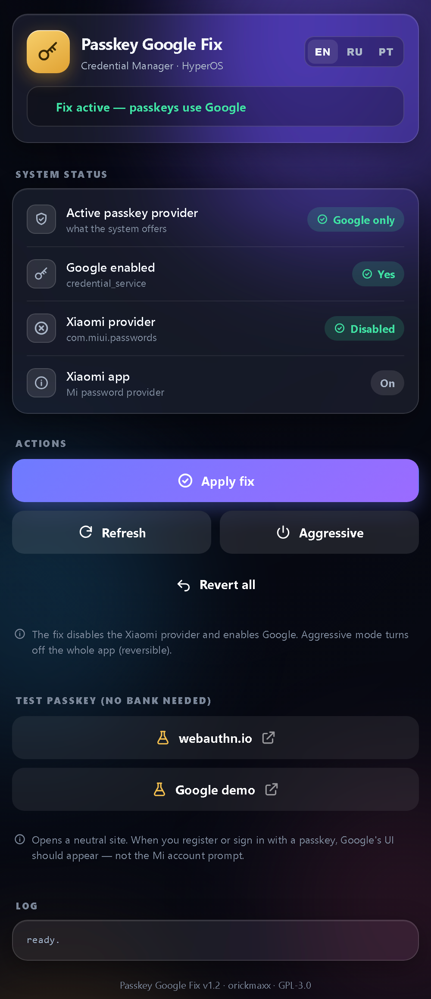
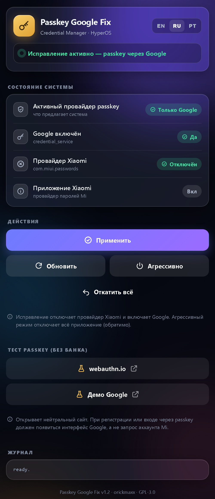

# 🔑 Passkey Google Fix (HyperOS)

A **KernelSU / KernelSU Next** module that forces the Android **Credential Manager**
to use **Google** for passkeys on Xiaomi **HyperOS**, instead of Xiaomi's own
provider — which demands a **Mi account** even when Google is set as your password
manager.

Systemless, fully reversible, with a premium multilingual WebUI.

## Screenshots

| English | Русский | Português |
|:---:|:---:|:---:|
|  |  |  |

The WebUI auto-detects your system language (defaults to English) and can be
switched in-app between **English · Русский · Português (BR)**.

## The problem

On HyperOS, when you sign in to an app (bank, WhatsApp, Discord…) with a **passkey**,
the system invokes Xiaomi's credential provider (`com.miui.passwords`) and asks you
to sign in with a Mi account — even though you selected **Google** as your password
manager in Settings.

This happens because:

1. Two providers register as `CredentialProviderService`: Google
   (`com.google.android.gms`) and Xiaomi (`com.miui.passwords`).
2. `credential_service_primary` points to Google (autofill), but the **passkey**
   flow uses the *enabled providers list* `credential_service` — which HyperOS
   leaves **empty**, so it falls back to prompting for Xiaomi's provider.

## The fix

This module does two things, and keeps them applied:

1. **Disables** the Xiaomi passkey provider component
   `com.miui.passwords/.credential.provider.XiaomiCredentialProviderService`.
2. **Enables Google** in `credential_service`
   (`com.google.android.gms/…PasswordAndPasskeyService`).

HyperOS clears `credential_service` **once** during post-boot (after the `service`
stage), so `service.sh` reapplies it in a ~4-minute post-boot window and then keeps
a light 120s watcher — no user interaction needed after a reboot.

Everything is systemless (no partition is modified) and **fully reversible**:
removing the module re-enables Xiaomi's provider and clears the list.

## Requirements

- KernelSU or **KernelSU Next**
- Android **14+** (API 34+, Credential Manager)
- A Xiaomi device on **HyperOS/MIUI** with `com.miui.passwords`

Built and tested on a Redmi Note 13 Pro 5G (`garnet`), HyperOS 3, Android 16.

## Install

1. Download `passkey_google_fix.zip` from
   [Releases](https://github.com/orickmaxx/passkey-google-fix/releases/latest).
2. KernelSU Next → **Modules → Install from storage** → pick the zip.
3. The fix applies immediately (no reboot needed); reboot keeps it persistent.

## WebUI

Open the module's **WebUI** button in KernelSU Next for a live panel:

- System status (active provider, Google enabled, Xiaomi provider/app state)
- **Apply fix**, **Aggressive mode** (turn off the whole Xiaomi app), **Revert all**
- **Passkey test** against a neutral site (`webauthn.io`) — no bank app required
- Languages: **English · Русский · Português (BR)**, auto-detected, switchable in-app

## Compatibility

This module **only** changes Credential Manager / passkey provider settings. It does
**not** touch, patch, or conflict with certification / Play Integrity modules or
Xposed frameworks — it is safe to run alongside your existing stack. Built and used
next to:

- [Zygisk Next](https://github.com/Dr-TSNG/ZygiskNext) — Zygisk provider for KernelSU
- [Tricky Store](https://github.com/5ec1cff/TrickyStore) — hardware key attestation
- [Integrity Box](https://github.com/MeowDump/Integrity-Box) — Play Integrity meta-module (PIF)
- [Vector](https://github.com/JingMatrix/Vector) — modern Xposed framework

*(Links go to each project's original repository. Those are separate projects by
their respective authors — not affiliated with this module.)*

## How it works (files)

| File | Role |
|---|---|
| `customize.sh` | validates target, applies the fix on install |
| `service.sh` | reapplies the fix after boot (post-boot window + watcher) |
| `uninstall.sh` | reverts everything on removal |
| `action.sh` | quick status via the Action button |
| `webroot/index.html` | the WebUI |

## About

Written **entirely by me** ([orickmaxx](https://github.com/orickmaxx)). I ran into
this exact problem on my own phone — HyperOS 3 forcing a Mi account for Google
passkeys — found no existing fix for it, so I built one and open-sourced it. If it
helps you, a ⭐ is appreciated.

## Disclaimer

This module changes credential-provider settings on your own device. It is
reversible, but use at your own risk. Not affiliated with Google or Xiaomi.

## License

[GPL-3.0](LICENSE) © [orickmaxx](https://github.com/orickmaxx)
